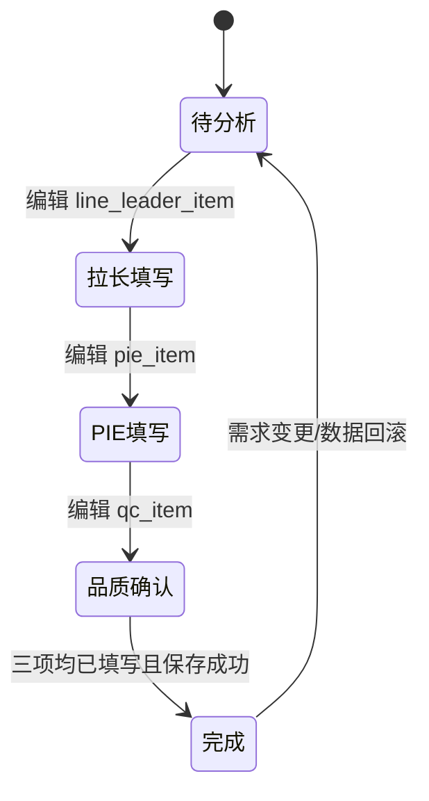

# UPH达成检讨系统技术文档

## 项目概述
- 目标：基于多源生产数据计算各时段 UPH（单位小时产出）与计划差异，提供首页总览与双击详情的在线调解与确认流程。
- 技术栈：前端 `Vue`，后端 `Node.js`，数据库 `MySQL`。
- 数据源：
  - 数据源A（长沙）：`maclib.mes_plan`、`maclib.mes_hqty2`、`maclib.mes_lineinfo`
  - 数据源B（深圳）：`maclib.mes_plan`、`maclib.mes_hqty2`、`maclib.mes_lineinfo`
  - 主业务库（pcmonitor）：`pcmonitor.uph_analys`（首页）与 `pcmonitor.uph_item`（详情）
- 首页字段：序号、机型、各 2 小时段差异数（8-10 … 6-8）、日期；颜色与百分比逻辑按需求定义。
- 详情页字段：拉长现象说明（署名）、PIE 原因与对策（署名）、品质确认（署名），编辑即保存，自动署名注入。

## 系统架构图
```mermaid
flowchart LR
  U[Web浏览器 (Vue)] -->|REST/JSON| B[Node.js API]
  subgraph Sources[源数据]
    CS[(MySQL 192.168.2.10\nmaclib)]
    SZ[(MySQL 192.168.192.4\nmaclib)]
  end
  subgraph PMDB[主业务库]
    PM[(MySQL 192.168.1.130\npcmonitor)]
  end
  B --> CS
  B --> SZ
  B --> PM
  B -.ETL/聚合/写入.-> PM
```
- 层次：`前端(Vue)` → `后端(Express)` → `数据访问层(DB Pool)`；提供 ETL/聚合服务从 `maclib` 计算并回写 `pcmonitor`。

## 前后端目录结构
- 后端 `backend/`
  - `src/routes/analyses.ts`：UPH 总览路由
  - `src/routes/items.ts`：详情编辑路由
  - `src/controllers/*`：参数校验与响应
  - `src/services/analysesService.ts`：差异计算与查询
  - `src/services/itemsService.ts`：编辑保存与自动署名
  - `src/services/syncService.ts`：从 maclib 聚合同步到 pcmonitor
  - `src/models/*`：数据结构与映射（Plan/HourlyQty/LineInfo/UphAnalys/UphItem）
  - `src/db/index.ts`：三个 MySQL 连接池（长沙/深圳/pcmonitor），读取凭据自 `.env`
  - `src/middleware/error.ts`：统一错误处理；`auth.ts`（可选）
- 前端 `frontend/`
  - `src/views/UphAnalysList.vue`：首页总览
  - `src/views/UphItemDetail.vue`：双击详情
  - `src/components/UphTable.vue`：表格与颜色/百分比渲染
  - `src/router/index.ts`、`src/store/index.ts`、`src/utils/diff.ts`、`src/api/index.ts`
  - 构建：`vite` 初始化与 `Tailwind`（可选样式库）

## 核心数据结构
- 源表（maclib）：
  - `mes_plan`：`ID`、`Model`、`Qty`、`FUpdateDate`、`LineID`
  - `mes_hqty2`：`ID`（1..24）、`PID`（计划ID）、`PQty`（标准）、`MQty`（MES达成）、`AQty`（实际达成）
  - `mes_lineinfo`：`id`、`lineModel`
- 业务表（pcmonitor）：
  - `uph_analys`：`serial_number`、`model_type`、`date_record`、`diff_cnt_8_10` … `diff_cnt_6_8`
  - `uph_item`：`id`、`line_leader_item`、`pie_item`、`qc_item`、`line_name`、`pie_name`、`qc_name`
- 关系：
  - `mes_plan.ID = mes_hqty2.PID`
  - `mes_lineinfo.id = mes_plan.LineID`
  - `uph_analys.serial_number = uph_item.id`
- TypeScript（示意）：
```ts
interface Plan { ID: number; Model: string; Qty: number; FUpdateDate: string; LineID: number }
interface HourlyQty { ID: number; PID: number; PQty: number; MQty?: number; AQty?: number }
interface LineInfo { id: number; lineModel: string }
interface UphAnalys {
  serial_number: number; model_type: string; date_record: string;
  diff_cnt_8_10: number; diff_cnt_10_12: number; diff_cnt_12_14: number; diff_cnt_14_16: number;
  diff_cnt_16_18: number; diff_cnt_18_20: number; diff_cnt_20_22: number; diff_cnt_22_24: number;
  diff_cnt_24_2: number; diff_cnt_2_4: number; diff_cnt_4_6: number; diff_cnt_6_8: number;
}
interface UphItem {
  id: number; line_leader_item?: string; pie_item?: string; qc_item?: string;
  line_name?: string; pie_name?: string; qc_name?: string;
}
```

## 差异计算与显示规则
- 2 小时分桶：`mes_hqty2.ID` 为小时序号（1..24），按 `(1,2)=8-10`、`(3,4)=10-12` … `(23,24)=6-8` 聚合为 12 段。
- 差异数：优先 `MQty - PQty`；缺少 `MQty` 时使用 `AQty - PQty`；将 1 小时数据合计为 2 小时段。
- 百分比：优先 `MQty / PQty`，否则 `AQty / PQty`；当 `< 0.9` 显示为红色。
- 颜色：差异数正数为绿色，负数为红色。

## API 设计
- `GET /api/analyses`
  - 查询参数：`date_from`、`date_to`、`model`、`line_leader_item`、`line_name`、`pie_item`、`pie_name`、`qc_item`、`qc_name`、`page`、`size`、`sort_by`、`sort_dir`
  - 响应：分页列表，含 12 段差异数与百分比、颜色标识、`serial_number`、`model_type`、`date_record`
- `GET /api/analyses/:serial_number`
  - 响应：组合 `uph_analys` + 对应 `uph_item` 的详情
- `GET /api/items/:id`
  - 响应：`uph_item`
- `PATCH /api/items/:id?userName=2020120767_张三`
  - 请求体：可选 `line_leader_item`、`pie_item`、`qc_item`
  - 规则：
    - 更新 `line_leader_item` 时，仅自动写入 `line_name = userName` 下划线后的中文名；不影响 `pie_name/qc_name`
    - 更新 `pie_item` 时，仅自动写入 `pie_name`
    - 更新 `qc_item` 时，仅自动写入 `qc_name`
  - 行为：编辑即保存（前端失焦触发），无需额外保存按钮
- `POST /api/sync`
  - 功能：从 `maclib` 读取 `mes_plan/mes_hqty2/mes_lineinfo`，计算 12 段差异并回写/更新 `pcmonitor.uph_analys`
  - 幂等：基于 `model_type + date_record` 或 `serial_number` 去重更新

### 数据访问示例 SQL（只读）
```sql
-- 计划
SELECT ID, Model, Qty, FUpdateDate, LineID FROM maclib.mes_plan WHERE FUpdateDate BETWEEN ? AND ?;
-- 每小时产出
SELECT ID, PID, PQty, MQty, AQty FROM maclib.mes_hqty2 WHERE PID = ? ORDER BY ID ASC;
-- 拉别
SELECT id, lineModel FROM maclib.mes_lineinfo WHERE id = ?;
```

## 详情页交互与排序/筛选/分页
- 交互：三处输入框（拉长/PIE/品质）可直接编辑，失焦自动保存，并按字段独立自动署名。
- 排序：首页与详情标题字段支持单击升/降序切换。
- 筛选：日期区间、机型、拉长现象说明、拉长姓名、PIE 原因与对策、PIE 姓名、品质确认、品质姓名，均为模糊筛选。
- 分页：`10/20/50/100` 可选，包含首页、上一页、下一页、末页；服务端分页。

## 调解流程状态机

- 守卫条件：
  - `userName` 注入规则与字段独立更新（只更新对应姓名字段）
  - `PQty=0` 时百分比显示“—”或按业务约定处理，避免除零
  - 保存失败或未通过校验留在当前状态并提示

## 安全与配置
- 凭据管理：所有数据库连接信息写入 `.env`，后端使用连接池读取；禁止将明文账户/密码写入代码或文档。
- 输入校验与防注入：统一使用参数化查询与校验中间件；记录操作审计日志（可选）。
- 访问控制：按需启用登录鉴权与角色控制（拉长/PIE/品质各自职责）。

## 非功能需求
- 性能：差异计算按批次/异步任务执行；热点查询缓存（可选）。
- 可维护性：按服务/模型分层，模块边界清晰；日志与错误集中处理。
- 可用性：失败重试与回滚策略；ETL 作业幂等。

## 里程碑（建议）
- 数据接入与建模 → 差异计算与 ETL → 首页/详情页 → 状态机与编辑即保存 → 筛选排序分页 → 安全与上线。
